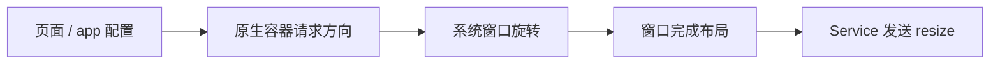

# 页面方向与窗口尺寸

[文档中心](./README.md) · [架构图](./Architecture-Diagram.md) · [能力参考](./API-Reference.md)

本文介绍 Android、iOS 和 Harmony 的页面方向配置与窗口尺寸回调。

页面方向功能默认关闭。只升级 SDK、不修改接入代码时，原有方向行为不会改变。

## 平台支持

| 能力 | Android | iOS | Harmony | Web |
| --- | --- | --- | --- | --- |
| `pageOrientation` 配置 | 支持 | 支持 | 支持 | 暂不支持 |
| 页面和组件 resize | 支持 | 支持 | 支持 | 支持 |
| `wx.onWindowResize()` / `wx.offWindowResize()` | 支持 | 支持 | 支持 | 支持 |

## 1. 配置页面方向

`pageOrientation` 可以写在 `app.json` 的 `window` 中：

```json5
{
  "window": {
    "pageOrientation": "auto"
  }
}
```

也可以写在页面的 `.json` 中：

```json5
{
  "pageOrientation": "landscape"
}
```

支持以下值：

| 值 | 行为 |
| --- | --- |
| `portrait` | 固定竖屏 |
| `landscape` | 固定横屏，允许向左或向右横屏 |
| `auto` | 使用系统当前允许的方向 |

页面配置优先于 app 配置。无效值会被忽略；两处都没有有效配置时使用 `portrait`。

优先级如下：

```text
页面配置 → app 配置 → portrait
```

`resizable` 用于 iPad、PC 等可调整窗口大小的设备，与手机横竖屏是不同能力，目前不在支持范围内。

## 2. 监听窗口尺寸变化

窗口尺寸变化后，Dimina 会提供以下回调：

| 回调 | 谁会收到 |
| --- | --- |
| 页面的 `onResize` | 当前页面 |
| 组件 `pageLifetimes` 里的 `resize` | 当前页面中的组件 |
| `wx.onWindowResize(listener)` | 当前小程序 |
| `wx.offWindowResize(listener?)` | 移除已注册的窗口监听函数 |

页面在 `Page()` 中声明 `onResize`，组件在 `pageLifetimes` 中声明 `resize`。这些回调由容器触发：

```js
Page({
  onResize(result) {
    console.log(result.size.windowWidth, result.deviceOrientation)
  },
})

Component({
  pageLifetimes: {
    resize(result) {
      console.log(result.size.windowWidth)
    },
  },
})
```

三个回调拿到的 `result` 形状相同：

```js
{
  size: {
    screenWidth: 393,
    screenHeight: 852,
    windowWidth: 393,
    windowHeight: 759
  },
  deviceOrientation: 'portrait'
}
```

`deviceOrientation` 为 `portrait` 或 `landscape`。

`screenWidth` / `screenHeight` 是屏幕尺寸，`windowWidth` / `windowHeight` 是页面可用的窗口尺寸。

容器会在窗口尺寸变化或路由完成（含冷启动）时上报。各回调的规则如下：

1. 页面的 `onResize` 与组件的 `resize` 只发给当前路由页面。返回缓存页时，即使尺寸未变，该页面也会收到一次当前尺寸。
2. `wx.onWindowResize()` 仅在宽、高或方向变化时触发。比较基准由整个小程序共用，首次上报一定触发。
3. 窗口完成布局后才发送新尺寸，不发送旋转过程中的临时尺寸。
4. 16ms 内的连续变化会合并处理，只保留各页面和窗口通道最后一次有效尺寸；页面隐藏或重新显示后，旧显示周期的 resize 会失效。
5. 固定方向页面不触发 resize；`auto` 页面按上述规则触发。窗口信息 API 始终返回最新尺寸。
6. `deviceOrientation` 缺失时按 `windowWidth > windowHeight` 推导。

> **尺寸口径**：原生端的窗口尺寸扣除安全区，但不扣导航栏和 TabBar；Kit 模拟器还会扣除导航栏和 TabBar。因此，切换 tab 页面或调用 `wx.hideTabBar` 可能只在模拟器中触发 `wx.onWindowResize`。

`wx.onWindowResize()` 注册的函数属于整个小程序，不会在当前页面卸载时自动删除。不再需要时，应调用 `wx.offWindowResize()`：

```js
function handleResize(result) {
  console.log(result.size)
}

wx.onWindowResize(handleResize)
wx.offWindowResize(handleResize)
```

不传函数时，`wx.offWindowResize()` 会移除通过该 API 注册的全部窗口监听函数。

## 3. 宿主接入

页面方向功能关闭时，SDK 不添加方向监听，也不调用系统方向 API；`pageOrientation` 不生效。

### 3.1 Android

初始化时启用：

```kotlin
Dimina.init(
    applicationContext,
    Dimina.DiminaConfig.Builder()
        .setPageOrientationEnabled(true)
        .build()
)
```

宿主还需要在自己的 manifest 中覆盖 `DiminaActivity`：

```xml
<manifest xmlns:android="http://schemas.android.com/apk/res/android"
    xmlns:tools="http://schemas.android.com/tools">
    <application>
        <activity
            android:name="com.didi.dimina.ui.container.DiminaActivity"
            android:screenOrientation="unspecified"
            android:configChanges="orientation|screenSize|smallestScreenSize|screenLayout|keyboardHidden"
            tools:replace="android:screenOrientation" />
    </application>
</manifest>
```

SDK 自带的 manifest 继续保持原来的竖屏设置，因此旧宿主只升级 SDK 时不会改变 Activity 的重建方式。

`portrait` 和 `landscape` 不受系统“自动旋转”开关限制。`auto` 使用系统的用户方向设置，会遵守“自动旋转”开关。

非 tab 页面由单独的 `DiminaActivity` 显示。该 Activity 退出后，方向重新由宿主 Activity 决定。

### 3.2 iOS

使用 `DMPNavigationController` 并启用页面方向：

```swift
let navigationController = DMPNavigationController()
app.getNavigator()?.setup(
    navigationController: navigationController,
    pageOrientationEnabled: true
)
```

宿主的 Info.plist 必须允许以下三个方向：

- `UIInterfaceOrientationPortrait`
- `UIInterfaceOrientationLandscapeLeft`
- `UIInterfaceOrientationLandscapeRight`

如果宿主使用自己的导航控制器，需要实现 `DMPPageOrientationForwarding`，并把以下属性交给 `topViewController` 决定：

- `supportedInterfaceOrientations`
- `shouldAutorotate`
- `preferredInterfaceOrientationForPresentation`

可以通过 `DMPNavigator.pageOrientationSupport` 检查接入状态：

| 状态 | 含义 |
| --- | --- |
| `.supported` | 已正确启用 |
| `.disabled` | 页面方向功能未启用 |
| `.unsupportedNavigationController` | 导航控制器不支持方向转发 |

页面与宿主共用 `UIWindowScene`，旋转会影响整个应用窗口。退出后由宿主页面重新决定方向，不保证恢复进入前的具体朝向。

方向配置提交被系统拒绝时，等待中的 `pageShow` 使用实际保留的窗口几何继续执行。

页面在推入动画结束后才声明方向，避免旋转中断转场。因此 `onLoad` 可能读到旋转前的尺寸，`onShow` 起为最终尺寸。

目前只支持一个正在使用的 Scene。iOS 不能读取系统旋转锁状态，因此 `auto` 在部分情况下可能不会遵守用户的竖屏锁。

### 3.3 Harmony

初始化时启用，并在 WindowStage 销毁时释放监听：

```ts
DMPApp.init(dmpConfig, { pageOrientationEnabled: true })

onWindowStageDestroy(): void {
  DMPApp.dispose()
}
```

承载小程序路由的宿主 `Navigation` 必须使用栈模式：

```ts
Navigation(this.pageInfos) {
  // 宿主页面
}
.mode(NavigationMode.Stack)
.navDestination(this.routerFactory)
```

ArkUI 的 `NavigationMode.Auto` 可能在横屏时切换为分栏，使宿主页面与小程序页面同时显示。外层 `Navigation` 的模式仍由宿主控制。

再次调用 `init` 会先移除旧监听。`dispose()` 会移除所有方向和尺寸监听，并忽略未完成的旧请求。

页面切换连续提交方向时：

- 相同方向只调用一次系统窗口接口；
- 不同方向按提交顺序处理；
- 较早请求晚于新请求返回时，较早结果会被忽略；
- 当前请求被系统拒绝后，同一页面方向仍可再次提交。

小程序和宿主共用一个窗口。最后一个小程序退出后，SDK 请求 `UNSPECIFIED`，让系统和宿主重新决定方向。

ArkUI 不能读取宿主之前通过 `setPreferredOrientation()` 设置的值，因此 SDK 无法精确恢复该值。

## 4. 实现说明



各端使用以下系统回调确认新尺寸已经生效：

| 平台 | 方向处理 | 尺寸变化依据 | 退出后 |
| --- | --- | --- | --- |
| Android | `DiminaActivity` | `decorView` 布局和 `Configuration` | 由宿主 Activity 决定方向 |
| iOS | `DMPPageController`、`DMPNavigationController` | `viewWillTransition` 的目标尺寸 | 由宿主页面决定方向 |
| Harmony | `DMPPageLifecycle`、`DMPDeviceUtil` | 窗口尺寸和安全区域变化 | 请求 `UNSPECIFIED` |

如果页面切换产生了新请求，较早请求稍后返回时不会覆盖新页面的方向，也不会再次触发生命周期。

### 4.1 iOS：转场期间谁有资格决定窗口方向

iOS 由 UIKit 向导航栈查询 `supportedInterfaceOrientations`。由于 `topViewController` 会在 pop 动画开始时提前切换，只有已稳定显示的页面才能决定方向。

`DMPPageController` 的认领资格需要三条同时成立：

| 条件 | 判据 |
| --- | --- |
| 已显示 | `viewDidAppear` 后、`viewDidDisappear` 前 |
| 已挂载 | `viewIfLoaded?.window != nil` |
| 转场结束 | 没有活跃的转场协调器 |

条件不满足时，导航控制器保持窗口当前方向；`viewDidAppear` 后再触发方向协商。

`viewWillTransition` 只接受正有限目标尺寸。无效目标会在转场完成后读取最终窗口尺寸；每次转场最多上报一次。

## 5. 已知限制

- Web 支持浏览器窗口 resize，但不支持页面方向锁定。Dimina Kit 模拟器的旋转由宿主项目实现。
- iOS 目前只支持一个活跃 Scene，且不能读取系统旋转锁。
- Harmony 无法读取宿主之前动态设置的方向。
- 从左横屏切换到右横屏时，宽高可能不变，但安全区域可能变化。刘海、Dynamic Island 和挖孔屏仍需使用对应真机验证。
- iOS 页面在推入动画结束后才旋转，因此 `onLoad` 可能读到旧尺寸。需要窗口尺寸时应在 `onShow` 中读取。
- 分屏、折叠屏和 iPad 多任务可能只改变窗口大小而不改变方向，目前尚未覆盖。
- iOS 的 `onShow` 只保证窗口几何已就绪，不保证 push 转场已经结束。转场取消或中断时，页面生命周期可能已经派发。

## 6. 源码入口

| 范围 | 文件 |
| --- | --- |
| Service resize 处理 | `fe/packages/service/src/core/runtime.js` |
| Service 窗口 API | `fe/packages/service/src/api/core/ui/window/index.js` |
| Android 方向转换 | `android/dimina/src/main/kotlin/com/didi/dimina/common/PageOrientation.kt` |
| Android 页面方向 | `android/dimina/src/main/kotlin/com/didi/dimina/ui/container/DiminaActivity.kt` |
| iOS 方向转换 | `iOS/dimina/DiminaKit/Common/DMPPageOrientation.swift` |
| iOS 导航控制器 | `iOS/dimina/DiminaKit/Navigator/DMPNavigationController.swift` |
| iOS 页面方向 | `iOS/dimina/DiminaKit/Container/DMPPageController.swift` |
| Harmony 方向转换 | `harmony/dimina/src/main/ets/DPages/DMPPageOrientation.ets` |
| Harmony 窗口方向 | `harmony/dimina/src/main/ets/Utils/DMPDeviceUtils.ets` |

完整的平台支持状态见[能力参考](./API-Reference.md)。
