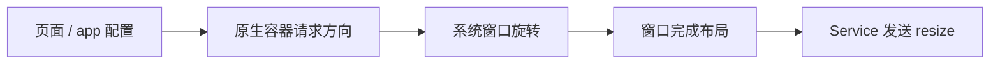

# 页面方向与窗口尺寸

[文档中心](./README.md) · [架构图](./Architecture-Diagram.md) · [能力参考](./API-Reference.md)

本文说明如何在 Android、iOS 和 Harmony 宿主中启用页面横竖屏，以及窗口尺寸变化时小程序会收到哪些回调。

页面方向功能默认关闭。只升级 SDK、不修改接入代码时，原有方向行为不会改变。

## 平台支持

| 能力 | Android | iOS | Harmony | Web |
| --- | --- | --- | --- | --- |
| `pageOrientation` 配置 | 支持 | 支持 | 支持 | 暂不支持 |
| 页面和组件 resize | 支持 | 支持 | 支持 | 支持 |
| `wx.onWindowResize()` / `wx.offWindowResize()` | 支持 | 支持 | 支持 | 支持 |

## 1. 配置页面方向

`pageOrientation` 可以写在 `app.json` 的 `window` 中：

```json5
{
  "window": {
    "pageOrientation": "auto"
  }
}
```

也可以写在页面的 `.json` 中：

```json5
{
  "pageOrientation": "landscape"
}
```

支持以下值：

| 值 | 行为 |
| --- | --- |
| `portrait` | 固定竖屏 |
| `landscape` | 固定横屏，允许向左或向右横屏 |
| `auto` | 使用系统当前允许的方向 |

页面配置优先于 app 配置。无效值会被忽略；两处都没有有效配置时使用 `portrait`。

优先级如下：

```text
页面配置 → app 配置 → portrait
```

`resizable` 用于 iPad、PC 等可调整窗口大小的设备，与手机横竖屏是不同能力，目前不在支持范围内。

## 2. 监听窗口尺寸变化

窗口尺寸变化后，Dimina 会提供以下回调：

| 回调 | 谁会收到 |
| --- | --- |
| 页面的 `onResize` | 当前页面 |
| 组件 `pageLifetimes` 里的 `resize` | 当前页面中的组件 |
| `wx.onWindowResize(listener)` | 当前小程序 |
| `wx.offWindowResize(listener?)` | 移除已注册的窗口监听函数 |

页面在 `Page()` 里声明 `onResize`，组件在 `Component()` 的 `pageLifetimes` 里声明 `resize`。
两者都是由容器调用的生命周期回调，业务不需要也不应该自己调用：

```js
Page({
  onResize(result) {
    console.log(result.size.windowWidth, result.deviceOrientation)
  },
})

Component({
  pageLifetimes: {
    // 组件所在页面收到 resize 时，这个函数会被调用
    resize(result) {
      console.log(result.size.windowWidth)
    },
  },
})
```

三个回调拿到的 `result` 形状相同：

```js
{
  size: {
    screenWidth: 393,
    screenHeight: 852,
    windowWidth: 393,
    windowHeight: 759
  },
  deviceOrientation: 'portrait'
}
```

`deviceOrientation` 为 `portrait` 或 `landscape`。

`screenWidth` / `screenHeight` 是整块屏幕，`windowWidth` / `windowHeight` 是页面真正可用的窗口，两者相差的是系统状态栏与导航栏；旋转时两组一起换宽高。微信官方文档只写了 `windowWidth` / `windowHeight`，但 `size` 是宿主给什么就透出什么，微信自己的宿主同样会带上屏幕尺寸。

容器在两种时候上报：一是窗口尺寸真的变了，二是每次路由落地（含冷启动）——后者不看尺寸变没变，落到哪一页就报哪一页。
两条回调的判定规则如下：

1. 页面的 `onResize` 与组件的 `resize` 只发给这次上报点到的那一页及其组件。
   容器不会因为「这次的尺寸和上次一样」就不发：从横屏页返回一个尺寸没再变过的缓存页时，
   这一页仍会收到一次自己的尺寸——它需要这次回调才能知道自己回到了哪种窗口里。
2. `wx.onWindowResize()` 相反，会把这次的宽、高、方向和上一次比较，三者都没变就不触发。
   这份比较基准由整个小程序共用，不是每个页面各存一份；初值为空，所以小程序启动后的
   第一次上报一定会触发一次。
3. 窗口完成布局后才发送新尺寸，不发送旋转过程中的临时尺寸。
4. 16ms 内连续发生的变化会合并为一次处理；页面在结算前隐藏或重新显示时，旧显示周期的 resize 会失效。
5. 固定方向页面两条回调一起沉默；`auto` 页面按上面两条规则触发。
   被沉默的那次变化仍然推进基线，也仍然刷新 `wx.getWindowInfo()` / `wx.getSystemInfoSync()` 读到的窗口尺寸。
6. `deviceOrientation` 缺失时按 `windowWidth > windowHeight` 推导。

> **口径提示**：`size` 里的 `windowWidth` / `windowHeight` 取自各端自己的 `getWindowInfo` 口径，
> 原生端报的是窗口扣安全区后的尺寸（不扣小程序导航栏与 TabBar），kit 模拟器扣掉导航栏与
> TabBar 预留。因此「tab 页 ↔ 非 tab 页跳转」「`wx.hideTabBar`」这类只改小程序自身 chrome、
> 不改设备窗口的操作，在模拟器上会推动应用级基线并触发一次 `wx.onWindowResize`，在原生端不会。
> 微信手机端在这类操作下是否触发 `wx.onWindowResize`：**未验证**。

`wx.onWindowResize()` 注册的函数属于整个小程序，不会在当前页面卸载时自动删除。不再需要时，应调用 `wx.offWindowResize()`：

```js
function handleResize(result) {
  console.log(result.size)
}

wx.onWindowResize(handleResize)
wx.offWindowResize(handleResize)
```

不传函数时，`wx.offWindowResize()` 会移除通过该 API 注册的全部窗口监听函数。

## 3. 宿主接入

页面方向功能关闭时，SDK 不添加方向监听，也不调用系统方向 API；`pageOrientation` 不生效。

### 3.1 Android

初始化时启用：

```kotlin
Dimina.init(
    applicationContext,
    Dimina.DiminaConfig.Builder()
        .setPageOrientationEnabled(true)
        .build()
)
```

宿主还需要在自己的 manifest 中覆盖 `DiminaActivity`：

```xml
<manifest xmlns:android="http://schemas.android.com/apk/res/android"
    xmlns:tools="http://schemas.android.com/tools">
    <application>
        <activity
            android:name="com.didi.dimina.ui.container.DiminaActivity"
            android:screenOrientation="unspecified"
            android:configChanges="orientation|screenSize|smallestScreenSize|screenLayout|keyboardHidden"
            tools:replace="android:screenOrientation" />
    </application>
</manifest>
```

SDK 自带的 manifest 继续保持原来的竖屏设置，因此旧宿主只升级 SDK 时不会改变 Activity 的重建方式。

`portrait` 和 `landscape` 不受系统“自动旋转”开关限制。`auto` 使用系统的用户方向设置，会遵守“自动旋转”开关。

非 tab 页面由单独的 `DiminaActivity` 显示。该 Activity 退出后，方向重新由宿主 Activity 决定。

### 3.2 iOS

使用 `DMPNavigationController` 并启用页面方向：

```swift
let navigationController = DMPNavigationController()
app.getNavigator()?.setup(
    navigationController: navigationController,
    pageOrientationEnabled: true
)
```

宿主的 Info.plist 必须允许以下三个方向：

- `UIInterfaceOrientationPortrait`
- `UIInterfaceOrientationLandscapeLeft`
- `UIInterfaceOrientationLandscapeRight`

如果宿主使用自己的导航控制器，需要实现 `DMPPageOrientationForwarding`，并把以下属性交给 `topViewController` 决定：

- `supportedInterfaceOrientations`
- `shouldAutorotate`
- `preferredInterfaceOrientationForPresentation`

可以通过 `DMPNavigator.pageOrientationSupport` 检查接入状态：

| 状态 | 含义 |
| --- | --- |
| `.supported` | 已正确启用 |
| `.disabled` | 页面方向功能未启用 |
| `.unsupportedNavigationController` | 导航控制器不支持方向转发 |

小程序页面与宿主页面使用同一个 `UIWindowScene`，因此显示小程序时会旋转整个应用窗口。退出小程序后，由宿主页面重新决定方向，但不保证恢复为进入小程序前的左横屏、右横屏或竖屏。

方向配置提交被系统拒绝时，等待中的 `pageShow` 使用实际保留的窗口几何继续执行。

页面只有在真正显示到屏幕上之后才声明自己的方向，窗口因此在页面推入动画结束之后才旋转：
在动画进行中旋转会让系统取消这次推入，页面被移出导航栈、内容不再加载。代价是被推入的页面
`onLoad` 里读到的窗口尺寸可能仍是旋转前的，`onShow` 起为最终尺寸（见「已知限制」）。

目前只支持一个正在使用的 Scene。iOS 不能读取系统旋转锁状态，因此 `auto` 在部分情况下可能不会遵守用户的竖屏锁。

### 3.3 Harmony

初始化时启用，并在 WindowStage 销毁时释放监听：

```ts
DMPApp.init(dmpConfig, { pageOrientationEnabled: true })

onWindowStageDestroy(): void {
  DMPApp.dispose()
}
```

承载小程序路由的宿主 `Navigation` 必须使用栈模式：

```ts
Navigation(this.pageInfos) {
  // 宿主页面
}
.mode(NavigationMode.Stack)
.navDestination(this.routerFactory)
```

ArkUI 默认使用 `NavigationMode.Auto`，窗口进入横屏后可能切换为左右分栏，导致宿主页面和小程序页面同时显示。SDK 控制窗口方向，外层 `Navigation` 的显示模式仍由宿主配置。

再次调用 `init` 时，SDK 会先移除上一次添加的监听。`dispose()` 会移除 WindowStage、窗口和尺寸变化监听，并忽略尚未返回的旧方向请求。

页面切换连续提交方向时：

- 相同方向只调用一次系统窗口接口；
- 不同方向按提交顺序处理；
- 较早请求晚于新请求返回时，较早结果会被忽略；
- 当前请求被系统拒绝后，同一页面方向仍可再次提交。

小程序和宿主共用一个窗口。最后一个小程序退出后，SDK 请求 `UNSPECIFIED`，让系统和宿主重新决定方向。

ArkUI 不能读取宿主之前通过 `setPreferredOrientation()` 设置的值，因此 SDK 无法精确恢复该值。

## 4. 实现说明



各端使用以下系统回调确认新尺寸已经生效：

| 平台 | 方向处理 | 尺寸变化依据 | 退出后 |
| --- | --- | --- | --- |
| Android | `DiminaActivity` | `decorView` 布局和 `Configuration` | 由宿主 Activity 决定方向 |
| iOS | `DMPPageController`、`DMPNavigationController` | `viewWillTransition` 的目标尺寸 | 由宿主页面决定方向 |
| Harmony | `DMPPageLifecycle`、`DMPDeviceUtil` | 窗口尺寸和安全区域变化 | 请求 `UNSPECIFIED` |

如果页面切换产生了新请求，较早请求稍后返回时不会覆盖新页面的方向，也不会再次触发生命周期。

### 4.1 iOS：转场期间谁有资格决定窗口方向

iOS 与另外两端的模型不同。Android 和 Harmony 是**推送**：容器为点名的那一页写一次方向请求
（`DiminaActivity.applyPageOrientation`、`DMPPageLifecycle.applyOrientation(app, webviewId)`）。
iOS 是**拉取**：UIKit 向导航栈索取 `supportedInterfaceOrientations`，而 `topViewController`
在 pop 动画开始前就已经指向落点页。因此必须约束「哪一页有资格认领方向」。

`DMPPageController` 的认领资格需要三条同时成立：

| 条件 | 判据 | 为什么不能少 |
| --- | --- | --- |
| 已落定在屏幕上 | `viewDidAppear` 置起、`viewDidDisappear` 清除 | 只置不清会让压在下面的页在 pop 动画中途就把窗口转走 |
| view 挂在窗口上 | `viewIfLoaded?.window != nil` | 不依赖 appearance 回调是否成对到齐，是 UIKit 同期维护的事实 |
| 没有转场在飞 | 转场协调器 | 覆盖非全屏 present 盖上再 dismiss、tab 容器转发等 appearance 未走完整轮的情形 |

不认领时交出的不是 UIKit 默认值，而是「框住窗口当前朝向」的 mask——转场期间维持现状，
落定后由 `viewDidAppear` 重新协商触发那一次旋转。朝向来源取导航控制器的 window，
因为 pop 刚开始时这一页的 view 还没挂进窗口。

`viewWillTransition` 的目标尺寸不是正有限数时整段跳过：负宽会让页面 rpx 基准变成负数，
非有限数过 JSON 通道在 iOS 上直接崩。代价是那一次旋转的 resize 事件对 JS 丢失
（在屏页无挂起 pageShow 时没有补报者），下一次真实旋转会纠正。

## 5. 已知限制

- Web 支持浏览器窗口 resize，但不支持页面方向锁定。Dimina Kit 模拟器的旋转由宿主项目实现。
- iOS 目前只支持一个活跃 Scene，且不能读取系统旋转锁。
- Harmony 无法读取宿主之前动态设置的方向。
- 从左横屏切换到右横屏时，宽高可能不变，但安全区域可能变化。刘海、Dynamic Island 和挖孔屏仍需使用对应真机验证。
- iOS 上被推入页面的 `onLoad` 可能读到旋转前的窗口尺寸。窗口在推入动画结束后才旋转，而页面内容的加载
  与这次旋转是并行的，两者先后不固定。`onShow` 及之后读到的都是最终尺寸；`auto` 页面还会收到 resize 回调，
  固定方向页面按规则不收（第 2 节第 5 条）。需要窗口尺寸时应在 `onShow` 里读，不要在 `onLoad` 里缓存。
- 分屏、折叠屏和 iPad 多任务可能只改变窗口大小而不改变方向，目前尚未覆盖。
- **iOS 的 `onShow` 不等 push 转场完成就派发。** `DMPNavigator` 里
  `pushViewController(_:animated:)` 只是启动转场就返回，紧接着就派发 `onShow`，中间不等
  `viewDidAppear`；返回方向的 `onUnload` 更是发生在 `popToViewController` 之前。
  打开页面方向能力后，容器会把 pageShow 序列化到「窗口几何就绪」之后，但判据是几何而不是转场，
  同方向的 `navigateTo` 仍判为已就绪、立刻派发。Android 的 pageShow 门判据是资源就绪
  （`Bridge.flushPageVisibility`），不挂视图转场；Harmony 点名单页，同样不涉及转场回调。
  由此可能观察到：`onLoad` / `onShow` 里同步读到上一页的窗口几何（已实测）；转场被打断时
  屏幕上那一页的 JS 已经 `onUnload`（容器侧无自愈路径）。交互式返回取消后目标页是否已收到
  `onShow`、`onShow` 里取最终布局位置是否读到中间态、微信手机端的同名时序，均**未验证**。

## 6. 源码入口

| 范围 | 文件 |
| --- | --- |
| Service resize 处理 | `fe/packages/service/src/core/runtime.js` |
| Service 窗口 API | `fe/packages/service/src/api/core/ui/window/index.js` |
| Android 方向转换 | `android/dimina/src/main/kotlin/com/didi/dimina/common/PageOrientation.kt` |
| Android 页面方向 | `android/dimina/src/main/kotlin/com/didi/dimina/ui/container/DiminaActivity.kt` |
| iOS 方向转换 | `iOS/dimina/DiminaKit/Common/DMPPageOrientation.swift` |
| iOS 导航控制器 | `iOS/dimina/DiminaKit/Navigator/DMPNavigationController.swift` |
| iOS 页面方向 | `iOS/dimina/DiminaKit/Container/DMPPageController.swift` |
| Harmony 方向转换 | `harmony/dimina/src/main/ets/DPages/DMPPageOrientation.ets` |
| Harmony 窗口方向 | `harmony/dimina/src/main/ets/Utils/DMPDeviceUtils.ets` |

完整的平台支持状态见[能力参考](./API-Reference.md)。
