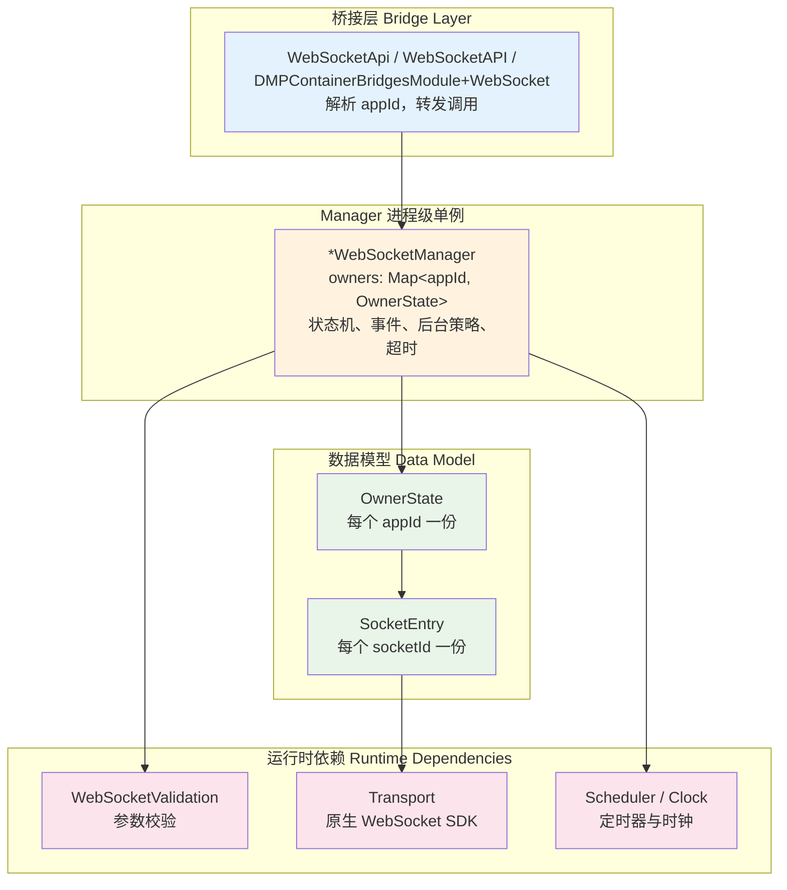
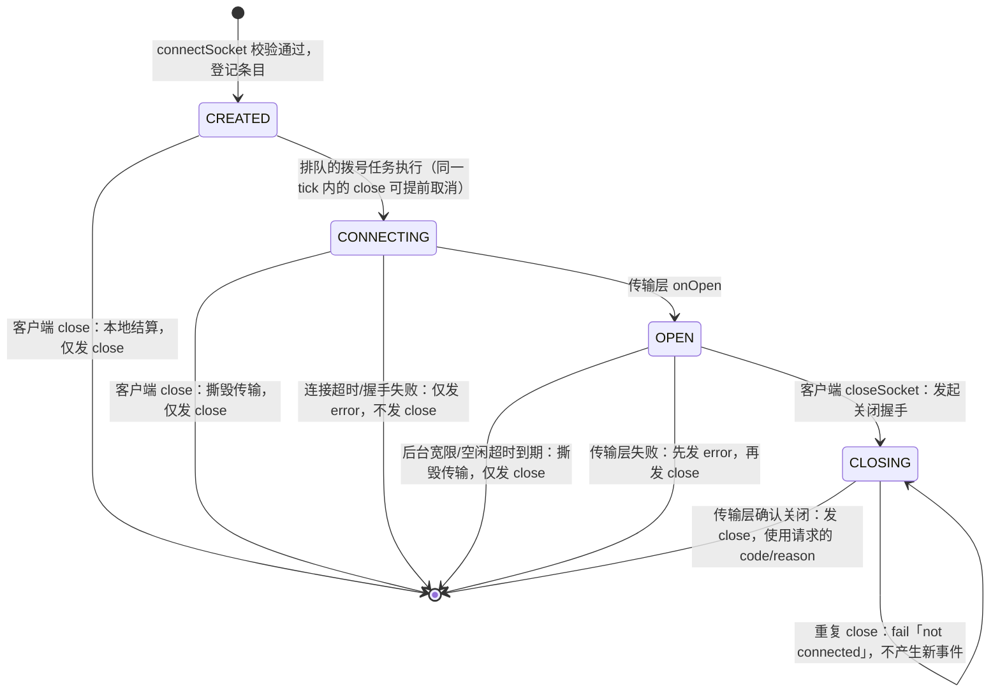

# WebSocket 能力与三端架构

[文档中心](./README.md) · [架构总览](./Architecture-Diagram.md) · [能力参考](./API-Reference.md)

Dimina 在 Android、iOS 和 HarmonyOS 容器中提供 `wx.connectSocket` 与 `SocketTask` 能力。Web 容器暂不提供该能力。

## 1. API 形态

微信小程序提供任务态和全局遗留态两套 WebSocket API。桥接参数中的 `socketId` 用于区分两种调用形态。

| 形态 | 连接模型 | 调用方式 |
| --- | --- | --- |
| `SocketTask` | 每个任务对应一条连接；单个小程序最多 5 条并发连接 | `wx.connectSocket()` 返回任务对象，后续操作和事件都通过任务对象完成 |
| 全局遗留 API | 每个小程序保留一个全局连接槽，未传 `socketId` 时绑定首条活跃连接 | 通过全局 `wx.sendSocketMessage`、`wx.closeSocket` 和事件 API 操作 |

三端桥接层包含以下 11 个 API：

| 类别 | API |
| --- | --- |
| 建立连接 | `connectSocket` |
| 发送与关闭 | `sendSocketMessage`、`closeSocket` |
| 连接事件 | `onSocketOpen`、`offSocketOpen` |
| 消息事件 | `onSocketMessage`、`offSocketMessage` |
| 错误事件 | `onSocketError`、`offSocketError` |
| 关闭事件 | `onSocketClose`、`offSocketClose` |

接口语义参考微信 `wx.connectSocket` 和 `SocketTask`。

## 2. 运行边界

| 项目 | 行为 |
| --- | --- |
| 并发上限 | 单个小程序最多保留 5 条连接 |
| 后台运行 | 进入后台后保留约 5 秒宽限；WebSocket 不在后台保活范围内 |
| 关闭码 | `code` 只接受 `1000` 或 `[3000, 4999]` |
| 空闲超时 | 由宿主配置，默认关闭 |
| App 销毁 | `disposeOwner` 清理该 `appId` 的连接和监听 |
| 二进制帧 | 原生层使用 base64 数据和 `isBuffer` 标记 |

参数校验由各端的 `*WebSocketValidation` 完成。精确的校验顺序和错误字符串以源码为准。

## 3. 三端架构

桥接层、Manager、连接模型和传输层组成三端共用的实现骨架。



| 组件 | 职责 |
| --- | --- |
| Bridge | 解析 `appId` 和参数，向 Manager 转发调用 |
| Manager | 管理 owner、校验结果、状态转换、事件顺序、后台宽限和超时 |
| `OwnerState` | 保存单个 `appId` 的连接、监听和全局遗留态 |
| `SocketEntry` | 保存单条连接的状态、传输对象和关闭信息 |
| Validation | 执行与平台 SDK 无关的参数校验 |
| Transport | 封装平台原生 WebSocket SDK |
| Scheduler / Clock | 驱动连接超时、后台宽限和空闲超时 |

状态变化、传输回调和定时器回调串行执行：Android 使用 `SerialExecutor`，iOS 使用 `DispatchQueue`，HarmonyOS 使用主事件循环。

## 4. 连接状态机

`SocketEntry` 或 `DMPSocketEntry` 的 `state` 记录连接状态和终态事件。



`wx.connectSocket()` 一返回原生就开始拨号，而调用方挂 `onOpen` / `onError` / `onClose` 是随后另外几条桥消息。本机回环地址上握手只要几毫秒，连接被拒更快（实测 8 毫秒，比调用方的注册消息早 1 毫秒），事件派发时监听器列表还是空的，这个事件就永久丢了。三端因此约定按事件补发一次，都在 `onSocketEvent` 里处理，且只对任务态生效：

| 事件 | 补发条件 | 载荷存放位置 |
| --- | --- | --- |
| `open` | 注册时连接已经是 OPEN | 连接条目上的 `openPayload` |
| `error`、`close` | 该 socketId 的这个事件已经派发过 | owner 上的 `terminalReplay`，键 `socketId|event` |

`error` 和 `close` 是终态，连接条目在派发时就已经从 owner 的 `sockets` 里删掉了，之后到达的注册再也找不到它，所以记录只能挂在 owner 上。`terminalReplay` 按插入顺序保留最近 32 条，超出淘汰最旧的；owner 销毁时整个对象被移出 owners 表，记录随之释放。这样调用方拿不拿得到事件与两条消息谁先到无关。

`SocketTask.readyState` 跟着真实事件走——收到 open 才是 `OPEN`，收到 close 或 error 才是 `CLOSED`，不挂在 `connectSocket` 的 success 上（success 只表示原生受理了请求，握手尚未完成）。JS 层为此在下发 connectSocket 之后给 open/error/close 各挂一个内部监听。

## 5. 统一命名

| 概念 | Android | iOS | HarmonyOS |
| --- | --- | --- | --- |
| 连接状态枚举 | `SocketState` | `DMPSocketState` | `DMPSocketState` |
| 单条连接状态 | `SocketEntry` | `DMPSocketEntry` | `DMPSocketEntry` |
| 每个 `appId` 的状态 | `OwnerState` | `DMPOwnerState` | `DMPOwnerState` |
| Manager 单例 | `WebSocketManager` | `DMPWebSocketManager` | `DMPWebSocketManager` |
| 校验命名空间 | `WebSocketValidation` | `DMPWebSocketValidation` | `DMPWebSocketValidation` |
| 传输层抽象 | `SocketTransport` | `DMPSocketTransport` | `DMPSocketTransport` |

Manager 入口统一使用 `connectSocket`、`sendSocketMessage`、`closeSocket`、`onSocketEvent` 和 `offSocketEvent`。

## 6. 平台实现差异

| 差异点 | Android | iOS | HarmonyOS |
| --- | --- | --- | --- |
| 任务态与遗留态分流 | `WebSocketApi.kt` 根据 `socketId` 分流 | Manager 根据 `socketId` 分流 | Manager 根据 `socketId` 分流 |
| 后台状态 | Activity 生命周期按 `appId` 通知 | `globallyBackgrounded` 记录进程状态，新 owner 继承 | `globallyBackgrounded` 记录进程状态，新 owner 继承 |
| 终态清理 | 按场景 helper，如 `terminateClientSide` | 统一进入 `teardown` | 按场景 helper，如 `performClientClose` |

一次 API 调用的 `success` 和 `complete` 是紧挨着发出的两条容器 → service 消息，必须按发出顺序送达 JS。iOS 的 `DMPService.fromContainer` 原来给每条消息各起一个不受管的 `Task {}`，会被丢到并发线程池上由不同线程执行，谁先排进 JS 线程完全看调度，`closeSocket` 上实测稳定出现 `complete` 早于 `success`。现在改为 `DMPEngine.enqueueScript()` 直接排进引擎的 JS 线程串行队列，投递顺序等于调用顺序。这条走的是所有 API 共用的回传路径，影响面不限于 WebSocket。

## 7. 代码入口

| 平台 | Manager 与校验 | 桥接层 |
| --- | --- | --- |
| Android | `android/dimina/src/main/kotlin/com/didi/dimina/api/network/`<br/>`WebSocketManager.kt`、`WebSocketValidation.kt` | 同目录下的 `WebSocketApi.kt` |
| iOS | `iOS/dimina/DiminaKit/Container/Api/Network/`<br/>`DMPWebSocketManager.swift`、`DMPWebSocketValidation.swift` | 同目录下的 `WebSocketAPI.swift` |
| HarmonyOS | `harmony/dimina/src/main/ets/Bridges/Network/DMPWebSocketManager.ts`<br/>校验 namespace 位于同一文件 | `harmony/dimina/src/main/ets/Bridges/Network/DMPContainerBridgesModule+WebSocket.ets` |

## 8. 端到端冒烟测试页

`fe/example/base/pages/socket-test/index.js` 是一个在真机/模拟器上跑的冒烟测试页，25 条用例连一个普通的 RFC6455 echo server，覆盖握手与 open 事件、文本收发、并发上限与名额释放、关闭码边界、连接过程中关闭、连不上的地址、连接被拒、send/close 的参数校验、success/fail/complete 回调序列、`offMessage` 的精确移除，以及全局遗留 API 的绑定、生命周期和 `wx.closeSocket` 清扫。

页面接受两个查询参数：`wsUrl` 覆盖服务地址，`autorun=1` 打开即自动开跑（模拟器上不方便模拟点击时用）。Android 模拟器用 `10.0.2.2` 访问宿主机，iOS 模拟器用 `127.0.0.1`。

iOS 上可以完全无人值守地跑：宿主 app 认三个环境变量——`DMP_TEST_AUTO_OPEN_APPID` 指定启动后自动打开的小程序，`DMP_TEST_ENTRY_PATH` 指定启动页，`DMP_TEST_ENTRY_QUERY` 按 `a=1&b=2` 的写法给启动页带参数（启动页路径本身不接受问号）。

```bash
SIMCTL_CHILD_DMP_TEST_AUTO_OPEN_APPID=wxbaf4b47de04f1d8a \
SIMCTL_CHILD_DMP_TEST_ENTRY_PATH='pages/socket-test/index' \
SIMCTL_CHILD_DMP_TEST_ENTRY_QUERY='autorun=1' \
xcrun simctl launch <device> com.didi.dimina
```
