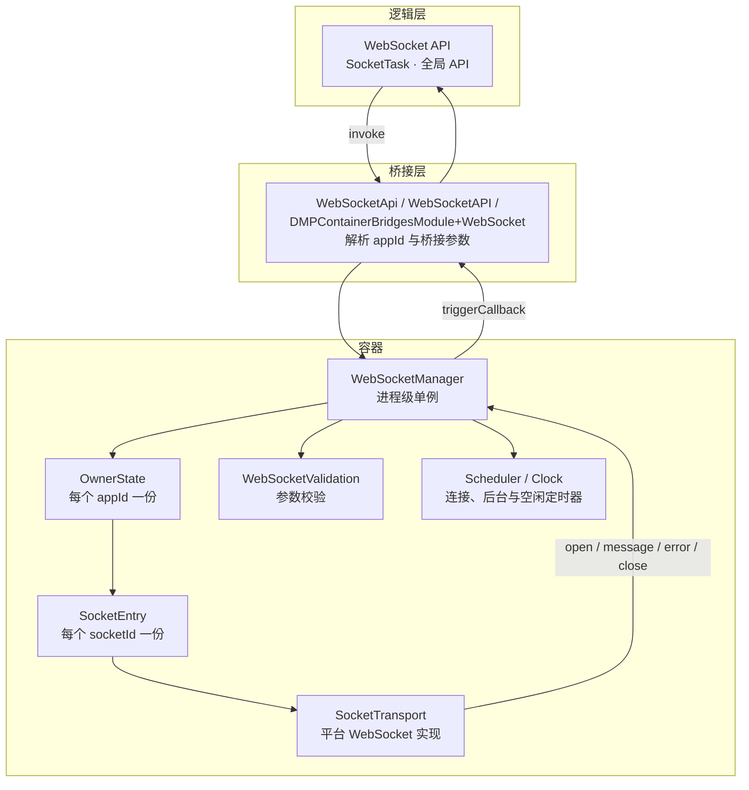
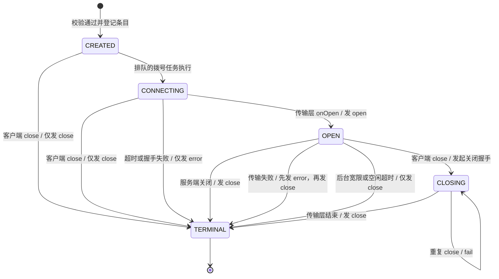

# WebSocket 能力与三端架构

[文档中心](./README.md) · [架构总览](./Architecture-Diagram.md) · [能力参考](./API-Reference.md)

Dimina 在 Android、iOS 和 Harmony 容器中提供 `wx.connectSocket`、`SocketTask` 及全局 WebSocket API，Web 容器暂未接入。该能力由逻辑层发起，经桥接层进入容器的连接管理器，再由平台传输层完成握手、收发和关闭；渲染层不参与连接管理。

## 1. 能力入口

`wx.connectSocket()` 在逻辑层生成唯一的 `socketId`，创建 `SocketTask` 并发起桥接调用。任务对象的返回不等待连接打开；原生侧校验通过后会登记连接、安排拨号，并触发 `success` 和 `complete`。业务代码应通过 `onOpen`、`onError` 和 `onClose` 判断连接结果。

WebSocket 提供任务态和全局态两种调用形态：

| 形态 | 连接定位 | 对外接口 |
| --- | --- | --- |
| `SocketTask` | 每个任务携带自己的 `socketId`，后续操作只作用于该连接 | `send`、`close`、`onOpen`、`offOpen`、`onMessage`、`offMessage`、`onError`、`offError`、`onClose`、`offClose` |
| 全局 API | 调用参数不含 `socketId`，使用当前小程序的全局绑定槽 | `wx.sendSocketMessage`、`wx.closeSocket` 及对应的全局事件注册与取消接口 |

`SocketTask` 保存 `socketId`，但不提供连接状态属性。单个 `appId` 最多同时保留 5 个连接条目，`CREATED`、`CONNECTING`、`OPEN` 和 `CLOSING` 状态都会占用这一限额。

创建新连接时，如果当前全局绑定没有指向存活条目，Manager 会把新连接设为全局目标。绑定连接终止后不会自动迁移到其他已有连接，下一次 `connectSocket` 才会建立新的绑定。全局 `closeSocket` 处理绑定连接后，还会使用 `code: 1000` 和空 `reason` 关闭其余存活连接；需要独立控制多条连接的业务应使用 `SocketTask`。

逻辑层与三端桥接层使用以下 11 个 API 名称：

| 类别 | API |
| --- | --- |
| 建立连接 | `connectSocket` |
| 发送与关闭 | `sendSocketMessage`、`closeSocket` |
| 注册事件 | `onSocketOpen`、`onSocketMessage`、`onSocketError`、`onSocketClose` |
| 取消事件 | `offSocketOpen`、`offSocketMessage`、`offSocketError`、`offSocketClose` |

## 2. 参数与数据边界

| 参数或数据 | 当前行为 |
| --- | --- |
| `url` | 必须是包含主机的 `ws://` 或 `wss://` 绝对地址，不能包含 fragment |
| `timeout` | 默认 60000 毫秒；小于等于 0 时使用默认值；正数向下取整，不能超过 `0x7fffffff` |
| `protocols` | 必须是字符串数组，数组项不能为空字符串 |
| `header` | 必须是对象；空名称和受限名称会被丢弃，同名不同大小写的字段会折叠成一条，非法字段名、换行或控制字符会导致调用失败 |
| `data` | 文本帧使用字符串；二进制帧接受 `ArrayBuffer`、`TypedArray` 和 `DataView` |
| `code` | 默认 1000，只接受 1000 或 `[3000, 4999]` 范围内的整数 |
| `reason` | 默认空字符串，UTF-8 编码后不能超过 123 字节 |

逻辑层会先用 JavaScript `Number()` 归一化 `timeout` 和 `code`。因此 `'3000'`、`' 3000 '` 和 `'0xBB8'` 都会作为数字 3000 进入桥接层；无法转换为有限数值的参数由原生校验拒绝。

`timeout` 除了驱动容器自己的连接定时器，也会设置到平台传输层：Android 用它设 OkHttp 的 `connectTimeout`，iOS 用它设 `URLRequest.timeoutInterval`，两者都在请求值上多留 1 秒余量，让容器的定时器先到、平台超时只当兜底。Harmony 的 `webSocket.WebSocketRequestOptions` 没有超时字段，那一端只有容器定时器。

请求头的值在逻辑层通过 `String()` 统一转换，`null` 和 `undefined` 会被移除。三端校验器按大小写不敏感的方式丢弃以下名称：

`connection`、`content-length`、`host`、`referer`、`sec-websocket-accept`、`sec-websocket-extensions`、`sec-websocket-key`、`sec-websocket-protocol`、`sec-websocket-version`、`upgrade`。

HTTP 字段名不区分大小写，`X-Token` 和 `x-token` 是同一个字段。逻辑层在下发前把它们折叠成一条，保留第一次出现的写法和位置，值取最后一个，避免三端对重复字段名的不同处理导致握手内容随平台变化。

容器不注入 `Origin`，`Origin` 也不在过滤集合中，调用方提供的自定义值会继续交给平台传输层。调用方提供的 `Referer` 会被丢弃，随后由容器注入：

```text
https://servicedimina.com/{appId}/{versionCode}/page-frame.html
```

版本号无法取得时使用 `0`。子协议不通过自定义请求头传入，而是由 Manager 根据 `protocols` 设置到平台请求中。

桥接消息使用 JSON，不能直接携带二进制对象。逻辑层会把 `ArrayBuffer` 及 `ArrayBuffer.isView()` 识别的视图复制为普通 `ArrayBuffer`，再编码成 `{ data: base64, isBuffer: true }`。底层为 `SharedArrayBuffer` 的视图也会先复制；`SharedArrayBuffer` 本身不作为二进制帧传输。入站二进制帧按相反顺序还原为 `ArrayBuffer`，`isBuffer` 不会暴露给业务回调。调用参数中自行设置的 `isBuffer` 会被逻辑层生成的编码结果覆盖或移除。

## 3. 三端实现骨架



桥接层负责取得 `appId`、识别任务态或全局态，并把参数交给 Manager。Manager 是进程级单例，但连接、监听器、全局绑定和后台状态都按 `appId` 隔离在 `OwnerState` 中。每个 `SocketEntry` 保存连接状态、平台传输对象、定时器、事件监听器、关闭参数和已派发的 `open` 载荷。

Validation 只负责参数归一化和错误检查。Transport 封装平台 WebSocket API，Scheduler 与 Clock 驱动连接超时、后台宽限和宿主配置的空闲超时。应用销毁时，`disposeOwner` 会静默移除对应 owner，关闭传输、取消定时器并释放监听器，不再向已经销毁的逻辑层发送事件。

连接状态、传输回调和定时器回调在串行执行环境中更新：Android 使用 `SerialExecutor`，iOS 使用专用 `DispatchQueue`，Harmony 通过 JavaScript 事件循环处理回调。业务代码不能依赖平台传输线程的具体调度顺序。

## 4. 连接状态机

`connectSocket:success` 表示参数校验通过、连接条目已经登记且拨号已经安排，不表示握手完成。真正的连接结果由状态机事件给出。



`CREATED` 和 `CONNECTING` 状态下的客户端关闭会在本地结束连接，并使用请求中的 `code` 和 `reason` 派发 `close`。握手超时或握手失败只派发 `error`，不会再补发 `close`。

连接打开后，服务端正常关闭只产生 `close`。未经请求的传输失败先产生 `error`，随后以 1006 结束连接并产生 `close`。客户端关闭已经进入 `CLOSING` 时，如果传输层随后失败，仍只使用客户端请求的 `code` 和 `reason` 派发 `close`。重复调用 `close` 会返回 `WebSocket is not connected`，不会生成第二个关闭事件。

进入终态后，条目会从 owner 的连接表中移除并释放并发名额。处于 `CLOSING` 的条目仍然存活，直到平台传输层返回关闭或失败结果。`closeSocket:success` 只表示关闭请求已被接受，业务代码仍应通过 `onClose` 等待连接终止。

## 5. 事件派发与运行边界

### 5.1 事件载荷

| 事件 | 载荷 |
| --- | --- |
| `open` | `header` 响应头与 `profile` 连接阶段时间信息 |
| `message` | 文本帧为字符串，二进制帧为 `ArrayBuffer` |
| `error` | 包含规范化后的 `errMsg` |
| `close` | 包含 `code` 和 `reason` |

`profile` 包含 `fetchStart`、`domainLookUpStart`、`domainLookUpEnd`、`connectStart`、`connectEnd`、`rtt`、`handshakeCost` 和 `cost`。Android 会使用传输层能够提供的 DNS 与连接时间；iOS 和 Harmony 对未暴露的阶段使用已有时间点回填，因此这些字段属于尽力提供的连接信息。

同一事件可以注册多个监听器。逻辑层按监听函数保存 callback id，原生侧按 callback id 去重，并按注册顺序派发。事件先发送给当前连接的任务态监听器；如果该连接是全局绑定目标，再发送给全局监听器。传入监听函数的 `off*` 只移除该函数，不传参数时移除该事件的全部已登记监听。

任务态监听支持快速连接结果补发：

- 注册 `onOpen` 时连接已经处于 `OPEN`，立即补发该条目保存的 `openPayload`。
- 注册 `onError` 或 `onClose` 时对应事件已经发生，从 owner 的 `terminalReplay` 中补发。
- `terminalReplay` 按 `socketId|event` 保存最近 32 条记录，超出后淘汰最早记录。
- `message` 不补发；全局事件监听也不使用补发机制。

### 5.2 后台、空闲与销毁

| 场景 | 行为 |
| --- | --- |
| 进入后台 | 启动 5 秒宽限计时器；期间返回前台会取消计时器 |
| 后台调用 API | `connectSocket`、`sendSocketMessage` 和 `closeSocket` 返回 `interrupted` |
| 宽限到期，连接尚未打开 | 终止握手，仅派发 `error` |
| 宽限到期，连接已经打开 | 终止连接，派发 `{ code: 1006, reason: "interrupted" }` |
| 空闲超时 | 默认关闭；宿主启用后，成功发送或收到消息会重新计时 |
| 空闲到期 | 终止 `OPEN` 连接，派发 `{ code: 1006, reason: "idle timeout" }` |
| 小程序销毁 | `disposeOwner(appId)` 静默清理连接、定时器、监听器与补发记录 |

后台宽限和空闲超时都是容器策略，不需要业务代码维护定时器。1006 只作为异常终止结果上报，不作为业务主动关闭时可传入的关闭码。

## 6. 平台实现

| 概念 | Android | iOS | Harmony |
| --- | --- | --- | --- |
| 桥接层 | `WebSocketApi` | `WebSocketAPI` | `DMPContainerBridgesModule+WebSocket` |
| Manager | `WebSocketManager` | `DMPWebSocketManager` | `DMPWebSocketManager` |
| 状态与数据模型 | `SocketState`、`SocketEntry`、`OwnerState` | `DMPSocketState`、`DMPSocketEntry`、`DMPOwnerState` | `DMPSocketState`、`DMPSocketEntry`、`DMPOwnerState` |
| 参数校验 | `WebSocketValidation` | `DMPWebSocketValidation` | `DMPWebSocketValidation` |
| 传输抽象 | `SocketTransport` | `DMPSocketTransport` | `DMPSocketTransport` |
| 平台传输 | `OkHttpSocketTransport` | `DMPURLSessionWebSocketTransport` | `@kit.NetworkKit` 的 `webSocket` |
| 串行环境 | `SerialExecutor` | `DispatchQueue` | JavaScript 事件循环 |

三端 Manager 都提供 `connectSocket`、`sendSocketMessage`、`closeSocket`、`onSocketEvent` 和 `offSocketEvent`。Android 在 `WebSocketApi.kt` 中根据 `socketId` 是否存在完成任务态与全局态分流；iOS 和 Harmony 在 Manager 内判断。分流依据是键是否存在，而不是值是否为真，因此空字符串或空值仍会进入任务态并按无效连接处理。

前后台状态的来源各不相同：Android 由 `DiminaActivity` 按 `appId` 通知，iOS 的 Manager 自己监听 `UIApplication` 的进程级通知，Harmony 由 `DMPAppLifecycle` 调用 `setAllBackgrounded`。iOS 和 Harmony 新建的 owner 会继承当前进程的后台标记。

`Referer` 中的版本号分别来自 Android 的 `MiniProgram.versionCode`、iOS 当前应用的 `jsAppVersion()` 和 Harmony 的 `bundleLoader.getJsAppVersion()`。

客户端主动关闭时，三端都会把请求的 `code` 和 `reason` 交给传输层，并在最终 `close` 事件中保留这组值。后台或空闲策略上报 1006 时，Android 和 iOS 使用取消或中止传输；Harmony 向平台传输层使用合法的默认码 1000，同时向逻辑层上报 1006。

`@ohos.net.webSocket` 还有两处行为发生在 Manager 之外，只影响服务端看到的握手和关闭帧，逻辑层收到的事件不受影响：该 SDK 会为每次握手补一个不带端口的 `Origin`，业务代码在 Harmony 上自行传入 `Origin` 时服务端会收到两个；客户端关闭时发到线路上的关闭码始终是 1000，`reason` 照发，依赖关闭码区分业务场景的服务端需要注意。

## 7. 源码入口

| 层或平台 | 文件 |
| --- | --- |
| 逻辑层 | `fe/packages/service/src/api/core/network/websocket/index.js` |
| 二进制转换 | `fe/packages/service/src/api/core/network/socket/shared.js` |
| Android | `android/dimina/src/main/kotlin/com/didi/dimina/api/network/WebSocketManager.kt`、`WebSocketValidation.kt`、`WebSocketApi.kt` |
| iOS | `iOS/dimina/DiminaKit/Container/Api/Network/DMPWebSocketManager.swift`、`DMPWebSocketValidation.swift`、`WebSocketAPI.swift` |
| Harmony | `harmony/dimina/src/main/ets/Bridges/Network/DMPWebSocketManager.ts`、`DMPContainerBridgesModule+WebSocket.ets` |

下一步可继续阅读[能力参考](./API-Reference.md)，确认 WebSocket 与其他网络能力在各平台的支持状态。
